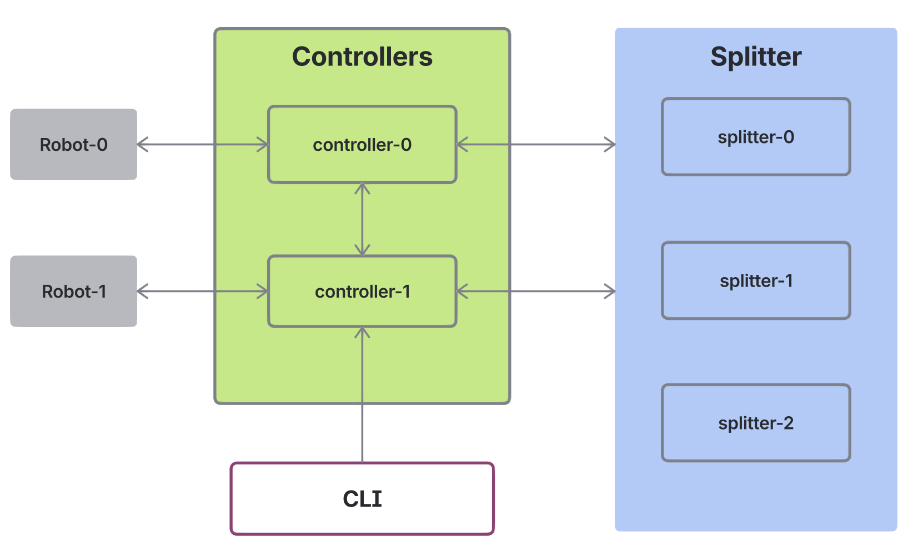

# Robots

## Overview

This is an example of a Splitter-based service that controls connected robots.
CLI can be used to send commands to the robots through the service.

The example consists of several components:

- Splitter cluster of three nodes
- Two instances of the service with controllers
- Two robots connecting to the controller
- CLI interface to issue commands to robots



The controller service is the central component:

- It handles shards assigned by Splitter. Each shard is handled by a range which
  is responsible for all robots with IDs that fall inside the shard. Handling
  a robot involves sending commands to robots based on external requests or
  initiating commands based on some conditions, e.g., scheduled periodically.

- Incoming connections and requests are resolved by the controllers
  and forwarded to the owning ranges. When ranges are on remote instances,
  the requests are forwarded using a separate gRPC service designated for
  internal communication.

Robots are implemented as standalone applications connecting to the controllers
using gRPC streams and printing the received commands.

The CLI application issues a command over gRPC to the controller and relies on
internal forwarding performed by the controllers.

## Setup

The example requires a Docker environment with Docker Compose and Bazel.

Build a Splitter container and load it into the Docker from the
[Splitter](https://github.com/atoms-co/splitter) repository.

```bash
git clone https://github.com/atoms-co/splitter
cd splitter
bazel run //:load
```

From the `robots` directory:

Start Splitter containers:

```bash
docker-compose --profile splitter up
```

Initialize Splitter configuration for this example:

```bash
docker exec -i robots-splitter-1-1 /bin/bash < ./init-splitter.sh
```

Build controllers and robots images and load them into Docker:

```bash
bazel run //robots:load
```

Start the containers:

```bash
docker-compose --profile robots up
```

## Testing

Run CLI to control a robot:

```bash
> bazel run //robots -- --endpoint localhost:8502 robot act move --location new-location1 --name robot-0
Robot robot-0 moved to new-location1
```

To observe how the system behaves during shard movements, try revoking a shard.

First, find the grant ID of the shard to revoke:

```bash
docker exec -i robots-splitter-1-1 /usr/local/bin/splitterctl --insecure -e localhost:50051 \
  operations coordinator info facilities/robots | jq .assignments.[].grants.[].id
```

Choose one of the listed UUIDs and revoke the grant:

```bash
docker exec -i robots-splitter-1-1 /usr/local/bin/splitterctl --insecure -e localhost:50051 \
  operations coordinator revoke facilities/robots -g <UUID>
```
